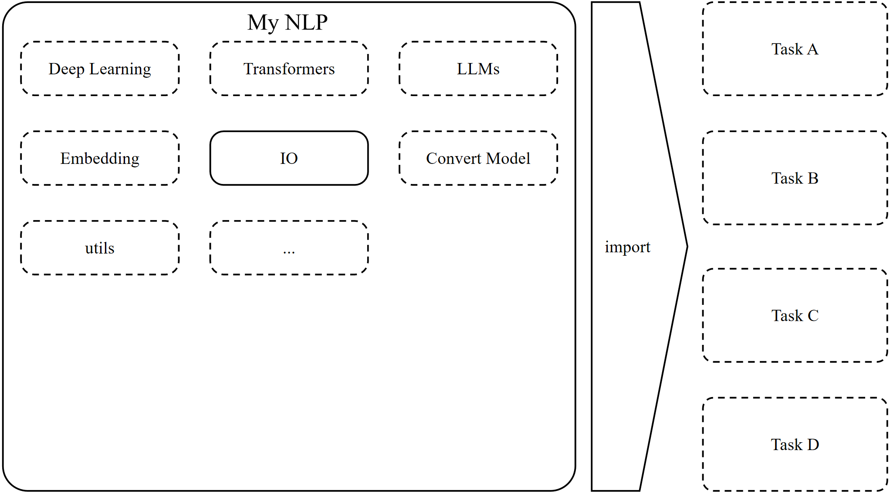

## My NLP
这是我学习NLP知识的技能总结，希望将常用的NLP工具和技术总结在这里，方便自己查阅，也希望能帮助到大家。

### 一、项目文档
待定

### 二、项目介绍

**My NLP**是一个NLP工具集合——将常用的NLP处理方法和工具总结在一起，以便于个人项目取用，避免重复造轮子。

### 三、项目结构

```text
.
├── my_io
└── readme.md
```

### 四、常用库
| 库            | 说明 | 官网 |
|--------------|--| ---- |
| transformers |  | https://huggingface.co/docs/transformers/index |
| scikit-learn | | https://scikit-learn.org/stable/ |
